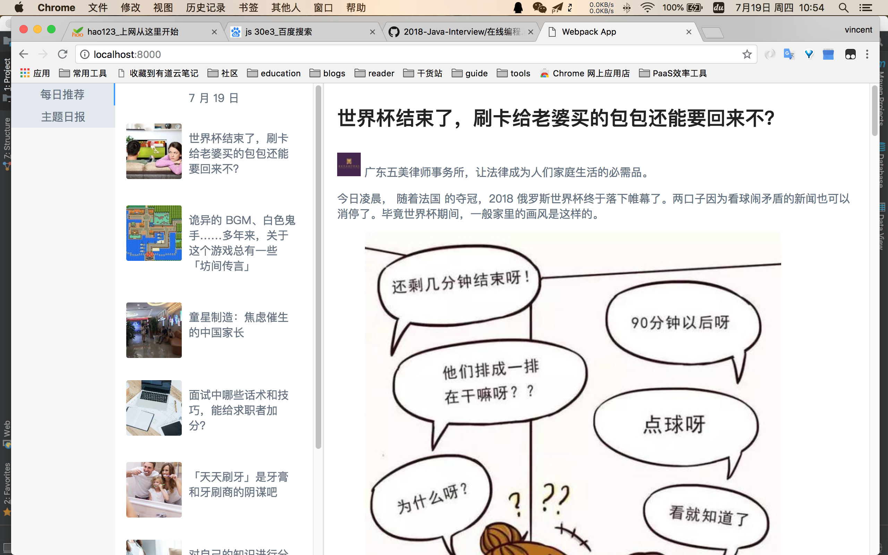

# zhihu-daily
Zhihu Daily implementation via Vue for practise

## guide
安装依赖

```npm install```

开启代理server

```node proxy.js```

本地跑

```npm run dev```

## 收获
* 学会了最基础的webpack的配置
* Vue 的基础用法，各种指令，模板，插件等
* es6的各种新特性，各种骚的写法

## 不足
* css样式很多还是想不到
* 没有将样式抽取出来 没有使用stylus 没有使用预处理
* 很多代码还是不够优雅 有的看起来让人觉得恶心心
* 接口跨域问题没法在生产环境下解决 仅仅只能够在开发模式下跑

## 改进点
* 接口跨域问题。不能用这种单独开一个代理服务来解决，可以使用插件来完成
* 样式不是很好看
* 工程打包

## 运行截图
